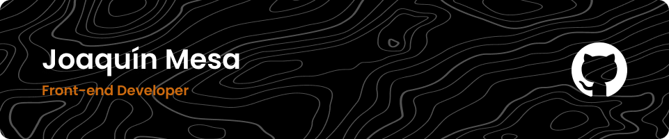

<h1 align="center">Hi 👋, I'm Joaco!</h1>

###

<h3 align="center">🚀 Front-end Developer and Digital Communication student</h3>

###

⚡️ I'm 21 years old and I'm from Buenos Aires, Argentina 🇦🇷

###

<h3 align="left">Connect with me!</h3>

###

  
  
  
  

###

<h3 align="left">Skillset</h3>

###

  
  
  
  
  
  
  
  
  
  
  
  
  
  
  
  
  

###

  
  
  
  
  
  
  
  
  
  
  

###
